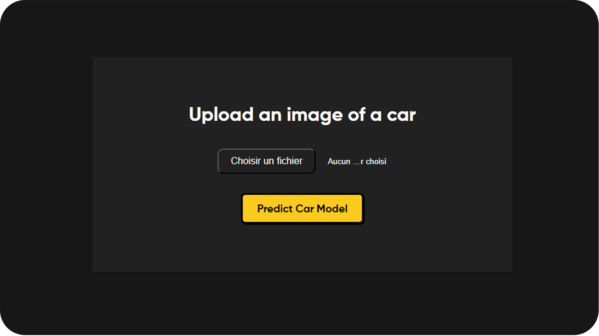

<h1 align="center">Car Identifier</h1>
<p align="center">
	
</p>
<p align="center">Car-Identifier uses a fine-tuned VGG16 model and Flask to identify car makes and models from uploaded images.</p>

# Under construction
Recognition of only 5 vehicles
- Alpine A110
- Honda Civic
- Renault Clio 3
- Renault Clio 4
- Toyota Corolla

# Install
```bash
  python app.py
```

# Credits

* [**Quentin PETIT**](https://github.com/quentinptt) : Creator of the project.

